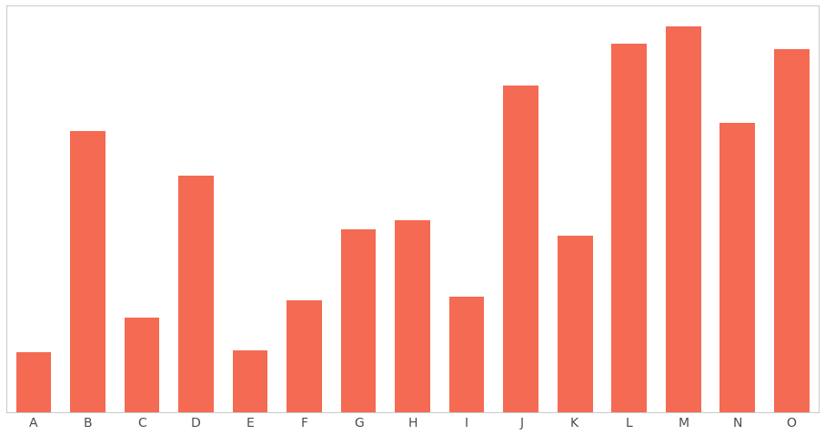

# Visualisasi Data

Visualisasi memegang peranan penting dalam menyampaikan informasi.

> The power of a graph is its ability to enable one to take in the quantitative information, organize it, and see patterns and structure not readily revealed by other means of studying the data.

\- Cleveland and McGill, 1984

Beberapa teknik dalam visualisasi mempermudah penyampaian informasi sehingga lebih mudah diinterpretasikan dan dipahami. 

---

Cleveland and McGill [1984] di papernya yang berjudul, "[Graphical Perception: Theory, Experimentation, and Application to the Development of Graphical Methods](https://www-jstor-org.libproxy.berkeley.edu/stable/2288400?seq=1#page_scan_tab_contents),"  menginventarisasi 10 elemen perceptual dasar yang dianggap cukup penting dalam "mengekstrak informasi qualitatif dari bagan / grafik".

> A graphical form that involves elementary perceptual tasks that lead to more accurate judgments than another graphical form (with the same quantitative information) will result in better organization and increase the chances of a correct perception of patterns and behavior.


---

Cleveland and McGill took a systematic approach in analyzing human graphical perception through experimentation. Their researched helped identify the most and least accurate elementary perceptual tasks, ordered below:

1. Position along a common scale
2. Position along non-aligned scales
3. Length, direction, angle
4. Area
5. Volume, curvature
6. Shading, color saturation

In 2010, [Heer and Bostock](http://vis.stanford.edu/files/2010-MTurk-CHI.pdf) confirmed these results using Amazon's Mechanical Turk.

---

Because we're only interested in relative sizes, we don't include a legend with size information or reference points.

![[drag=30 40, drop=right, opacity=0.1]](assets/circles.png)

For circles of distinctly different sizes, the comparison is simple. For example, "A" is smaller than "B." However, for circles, such as "L" and "M," that are almost the same size, it's difficult to tell which is smaller. Area, according to Cleveland and McGill's research, is less accurate than, say, length, which we consider next.

Focusing on "L" and "M," it is clear to see which is larger. You might be wondering whether scale makes a difference—that is, if the small circle sizes make it difficult to compare—it doesn't.

---

Next, we consider a case where we want to plot two series. For this example, let's suppose we're working with student English and math test scores. Here, we'll want to use bars, which we arbitrarily label Z-L. The question is, which bars should we use? This is a case where the answer depends on what we're trying to communicate. If we're interested in showing total scores, we could use a stacked bar chart.



We can tell that "Y" and "L" had the highest cumulative scores. What if we want to know which students scored highest on the math exam? 

---

Because the math portions of each bar are on "non-aligned scales," as Cleveland and McGill call it, it's difficult to tell. One solution is to plot these on opposite sides of the x-axis.


Now, it's easier to see that "R" scored quite well on the math exam. The tradeoff with this layout is that it's difficult to compare cumulative scores. Comparing "Z" and "O," for example, is a challenge. Again, it depends on what the message is.

---


---

# Visualization using Python

[W]e'll start by using a popular python package called `matplotlib`, and later on use a second package called `seaborn` that builds on `matplotlib`

```
import math
import random

import numpy as np
import pandas as pd
import matplotlib as mpl
import matplotlib.pyplot as plt
```

---

## **Histogram**

Histograms plot a discretized distribution of a one-dimensional dataset across all the values it has taken. They visualize how many of the data points are in each of $b$ bins, each of which has a pre-defined range. 

To create a histogram plot in `matplotlib` we'll use `pyplot`, which is a collection of command style functions that make matplotlib work like MATLAB and save many lines of repeated code. By convention, `pyplot` is aliased to `plt`, which we've alread done in the above import cell. 

---

```
plt.hist(gm_latest['gdpPercap']);
plt.title('Distribution of Global Per-Capita GDP in 2007')
plt.xlabel('Per-Capita GDP (Millions of USD)')
plt.ylabel('# of Countries');
```


Each line in the histogram represents a bin. The height of the line represents the number of items (countries in this case) within the range of values spanned by the bin. In the last plots we used the default number of bins (10).

---

now let's use more bins by specifying the bin=20 parameter.

```
plt.hist(gm_latest['gdpPercap'], bins=30);
plt.title('Distribution of Global Per-Capita GDP in 2007')
plt.xlabel('Per-Capita GDP (Millions of USD)')
plt.ylabel('# of Countries');
```


We can see this histogram doesn't look as "smooth" as the last one. There's no "right" way to display a histogram, but some bin counts definitely are more informative than others. For example, using only 3 bins we cannot see the bi-modal nature of the GDP distribution.

---

```
plt.hist(gm_latest['gdpPercap'], bins=3);
plt.title('Distribution of Global Per-Capita GDP in 2007')
plt.xlabel('Per-Capita GDP (Millions of USD)')
plt.ylabel('# of Countries');
```


---

## **Bar Plot**

Menampilkan 


---

## **Pie Chart**


---

## **Box Plot**


---

## **Line Chart**


---

## **Scatter Plot**

---

# **Customization**

